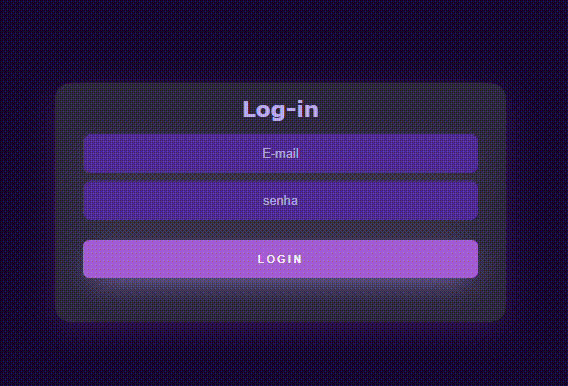

# form-Login

Este trabalho foi prposto por leonardo da diciplina de fundamentos web, no qual nos solicitou um formulario de cadastro com as seguintes informações.

* Email 
* Senha 
* Botão (acessar)
 
### TECNOLOGIAS USADAS 

* HTML5
* CSS3 
* GIT
* GITHUB
* BOOTSTRAP

### RESULTADO DO TRABALHO

